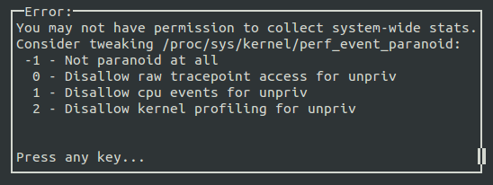
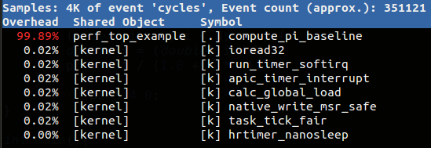
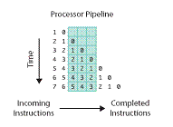
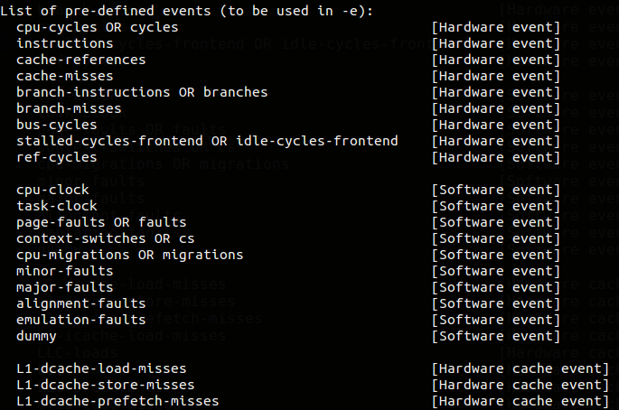

---
title: Linux 效能分析工具: Perf
categories: performance, linux, pmu
...

## 简介
[Perf](https://perf.wiki.kernel.org/index.php/Main_Page) 全名是 Performance Event，是在 Linux 2.6.31 以后内建的系统效能分析工具，它随着核心一并释出。借由 perf，应用程式可以利用 PMU (Performance Monitoring Unit), tracepoint 和核心内部的特殊计数器 (counter) 来进行统计，另外还能同时分析运行中的核心程序代码，从而更全面了解应用程式中的效能瓶颈。

相较於 [OProfile](https://en.wikipedia.org/wiki/OProfile) 和 [GProf](https://sourceware.org/binutils/docs/gprof/) ，perf 的优势在于与 Linux Kernel 紧密结合，并可受益于最先纳入核心的新特征。perf 基本原理是对目标进行取样，纪录特定的条件下所侦测的事件是否发生以及发生的次数。例如根据 tick 中断进行取样，即在 tick 中断内触发取样点，在取样点里判断行程 (process) 当时的 context。假如一个行程 90% 的时间都花费在函数 foo() 上，那么 90% 的取样点都应该落在函数 foo() 的上下文中。

Perf 可取样的事件非常多，可以分析 Hardware event，如 cpu-cycles、instructions 、cache-misses、branch-misses ...等等。可以分析 Software event，如 page-faults、context-switches ...等等，另外一种就是 Tracepoint event。知道了 cpu-cycles、instructions 我们可以了解 Instruction per cycle 是多少，进而判断程序代码有没有好好利用 CPU，cache-misses 可以晓得是否有善用 Locality of reference ，branch-misses 多了是否导致严重的 pipeline hazard？另外 Perf 还可以对函数进行采样，了解效能卡在哪边。

## 安装
首先利用以下指令查看目前的 Kernel config 有没有启用 Perf。如果 PC 上是装一般 Linux distro，默认值应该都有开启。
```
＄ cat "/boot/config-`uname -r`" | grep "PERF_EVENT"
```
如果自己编译核心可以参照[这篇文章](http://www.carbondesignsystems.com/virtual-prototype-blog/using-the-arm-performance-monitor-unit-pmu-linux-driver)来启用 perf。


参考的环境是 Ubuntu 14.04，kernel 版本 3.16.0。有两种方法可以安装

1.  前面讲到，perf 是 Linux 内建支持的效能优化工具，在 2.6.31 版本之后，我们可以直接到 [Linux Kernel Archives](https://www.kernel.org/) 下载对应版本的程序代码，解压缩后到 `tools/perf` 里面去编译，通常过程中会有相依的套件需要安装，依指示完成安装后，编译即可成功，最后再把编译完成的 perf 移至 `/usr/bin` 中就可以使用了。 
这种方法通常适用于更新过 kernel 的使用者，因为更新过 kernel 后会造成 distribution package 与 kernel version 不相符。一般使用者采用第二种方法即可。


2. 使用 apt-get 进行安装。 
```
$ sudo apt-get install linux-tools-common
```

接着输入 perf list 或 perf top 检查一下 perf 可不可以使用。

如果出现以下的讯息，表示还漏了些东西。

    WARNING: perf not found for kernel 3.16.0-50
    You may need to install the following packages for this specific kernel:
        linux-tools-3.16.0-50-generic
        linux-cloud-tools-3.16.0-50-generic

上面的 Kernel 版本可能和你不一样，根据指示安装起来即可。不放心的话可以使用`＄ uname -r`确认。
```
$ sudo apt-get install linux-tools-3.16.0-50-generic linux-cloud-tools-3.16.0-50-generic
```

3. 到这里 perf 的安装就完成了。不过这里我再稍微补充一下，如果你不是切换到 root 的情况下输入
```
$ perf top
```
其实会出现以下错误画面。




kernel.perf_event_paranoid 是用来决定你在没有 root 权限下 (Normal User) 使用 perf 时，你可以取得哪些 event data。默认值是 1 ，你可以输入
```
$ cat /proc/sys/kernel/perf_event_paranoid
```
来查看权限值。一共有四种权限值:


`2` : 不允许任何量测。但部份用来查看或分析已存在的纪录的指令仍可使用，如 perf ls、perf report、perf timechart、 perf trace。

`1` : 不允许 CPU events data。但可以使用 perf stat、perf record 并取得 Kernel profiling data。

`0` : 不允许 raw tracepoint access。但可以使用 perf stat、perf record 并取得 CPU events data。

`-1`: 权限全开。

最后如果要检测 cache miss event ，需要先取消 kernel pointer 的禁用。
```
$ sudo sh -c " echo 0 > /proc/sys/kernel/kptr_restrict"
```

## 先来个范例暖身吧！
一开始，我们先使用第一次作业 「计算圆周率」 的程式来体会一下 perf 使用。
[perf_top_example.c]
```c
#include <stdio.h>
#include <unistd.h>

double compute_pi_baseline(size_t N) {
    double pi = 0.0;
    double dt = 1.0 / N;
    for (size_t i = 0; i < N; i++) {
        double x = (double) i / N;
        pi += dt / (1.0 + x * x);
    }
    return pi * 4.0;
}
int main() {
    printf("pid: %d\n", getpid());
    sleep(10);
    compute_pi_baseline(50000000);
    return 0;
}
```
将上述程式存盘为 perf_top_example.c，并执行：
```
g++ -c perf_top_example.c
g++ perf_top_example.o -o example
./example
```
执行上述程式后，可以取得一个 pid 值，再根据 pid 输入 
```
perf top -p $pid
```
应该会得到类似下面的结果：



默认的 performance event 是 「cycles」，所以这条指令可以分析出消耗 CPU 周期最多的部份，结果显示函数 compute_pi_baseline() 佔了近 99.9％，跟预期一样，此函数是程式中的「热点」！有了一些感觉后，后面会详细一点介绍 perf 用法。

## 背景知识
以下节录上海交大通信与电子工程系的刘明写的文章： 

[Perf -- Linux下的系统性能调优工具](https://www.ibm.com/developerworks/cn/linux/l-cn-perf1/)

[简繁体中文词汇对照：科技纇](https://zh.wikipedia.org/zh-tw/Wikipedia:%E7%B9%81%E7%AE%80%E5%88%86%E6%AD%A7%E8%AF%8D%E8%A1%A8#.E7.A7.91.E6.8A.80)
(本课程斟酌修改词汇，`==>` 开头表示补充)


- **背景知识**

有些背景知识是分析性能问题时需要瞭解的。比如硬件 cache；再比如操作系统核心。应用程式的行为细节往往是和这些东西互相牵扯的，这些底层的东西会以意想不到的方式影响应用程式的性能，比如某些程式无法充分利用 cache，从而导致性能下降。比如不必要地呼叫过多的系统呼叫，造成频繁的核心 / 使用者层级的切换 ...等等。这里只是为本文的后续内容做些概述，关于效能调校还有很多东西。


- **效能相关的处理器硬体特性，PMU 简介**

当演算法已趋於最优化，程序代码不断精简，人们调到最后，便需要斤斤计较了。cache、pipeline 等平时不大注意的东西也必须精打细算了。


- **硬体特性之 cache**

记忆体存取很快，但仍无法和处理器的指令执行速度相提并论。为了从记忆体中读取指令 (instruction) 和资料 (data)，处理器需要等待，用处理器的时间来衡量，这种等待非常漫长。cache 是一种 SRAM，它的存取速率非常快，与处理器处理速度较为接近。因此将常用的资料保存在 cache 中，处理器便无须等待，从而提高效能。cache 的尺寸一般都很小，充分利用 cache 是软体效能改善过程中，非常重要的部分。


- **硬体特性之 pipeline, superscalar, out-ot-order execution**

提昇效能最有效的方式之一就是平行 (parallelism)。处理器在设计时也尽可能地平行，比如 pipeline, superscalar, out-of-execution。

处理器处理一条指令需要分多个步骤完成，比如 fetch 指令，然后完成运算，最后将计算结果输出到总线 (bus) 上。在处理器内部，这可以看作一个三级 pipeline，如下图处理器 pipeline 所示：



指令从左边进入处理器，上图中的 pipeline 有三级，一个时钟周期内可以同时处理三条指令，分別被 pipeline 的不同部分处理。

Superscalar 指一个时钟周期触发 (issue) 多条指令的 pipeline机器架构，比如 Intel 的 Pentium 处理器，内部有两个执行单元，在一个时钟周期内允许执行两条指令。

==> 这样称为 dual-issue，可想像为一个 packet 里同时有两组 pipelined 的 instruction

==> 比方说，[Cortex-A5](http://www.arm.com/products/processors/cortex-a/cortex-a5.php) 和 Cortex-A8 一样采用 ARMv7-A 指令集，但是 Cortex-A5 是 Cortext-A8/A9 的精简版，有以下差异：

1.pipeline 自 13 stages 减为 8 stages
2.instruction 自 dual-issue 减为 single-issue
3.NEON/FPU 为选配
4.不具有 L2 Cache

此外，在处理器内部，不同指令所需要的执行时间和时钟周期是不同的，如果严格按照程序的执行顺序执行，那么就无法充分利用处理器的 pipeline。因此指令有可能被乱序执行 (out-of-order execution)。

上述三种平行技术对所执行的指令有一个基本要求，即相邻的指令相互没有依赖关系。假如某条指令需要依赖前面一条指令的执行结果数据，那么 pipeline 便失去作用，因为第二条指令必须等待第一条指令完成。因此好的软体必须尽量避免产生这种程序代码。


- **硬体特性之 branch prediction**

branch prediction 指令对软体效能影响较大。尤其是当处理器采用流水线设计之后，假设 pipeline 有三级，且目前进入 pipeline 的第一道指令为分支 (branch) 指令。假设处理器顺序读取指令，那么如果分支的结果是跳跃到其他指令，那么被处理器 pipeline 所 fetch 的后续两条指令势必被弃置 (来不及执行)，从而影响性能。为此，很多处理器都提供了 branch prediction，根据同一条指令的历史执行记录进行预测，读取最可能的下一条指令，而并非顺序读取指令。

==> 搭配简报: [Branch Prediction](http://www.cs.ucr.edu/~gupta/teaching/203A-09/My6.pdf)

branch prediction 对软体架构有些要求，对于重复性的分支指令序列，branch prediction 硬体才能得到较好的预测结果，而对于类似 switch-case 一类的程式结构，则往往不易得到理想的预测结果。

==> 对照阅读: [Fast and slow if-statements: branch prediction in modern processors](http://igoro.com/archive/fast-and-slow-if-statements-branch-prediction-in-modern-processors/)

==> 编译器提供的辅助机制: [Branch Patterns, Using GCC](http://cellperformance.beyond3d.com/articles/2006/04/branch-patterns-using-gcc.html)

上面介绍的几种处理器特性对软体效能影响很大，然而依赖时钟进行定期采样的 profiler 模式无法阐述程式对这些处理器硬体特性的使用情况。处理器厂商针对这种情况，在硬体中加入了 PMU (performance monitor unit)。PMU 允许硬体针对某种事件设置 counter，此后处理器便开始统计该事件的发生次数，当发生的次数超过 counter 内设定的数值后，便产生中断。比如 cache miss 达到某个值后，PMU 便能产生相应的中断。一旦捕获这些中断，便可分析程式对这些硬体特性的使用率了。


- **Tracepoints**

Tracepoint 是散落在核心原始程序代码的一些 hook，一旦使能，在指定的程序代码被运行时，tracepoint 就会被触发，这样的特性可被各种 trace/debug 工具所使用，perf 就是这样的案例。若你想知道在应用程式执行时期，核心记忆体管理模块的行为，即可透过潜伏在 slab 分配器中的 tracepoint。当核心运行到这些 tracepoint 时，便会通知 perf。

Perf 将 tracepoint 产生的事件记录下来，生成报告，通过分析这些报告，效能分析调校的工程人员便可瞭解程式执行时期的核心种种细节，也能做出针对效能更準确的诊断。


## Perf 基本使用
前面有提到，Perf 能触发的事件分为三类：

- **hardware** : 由 PMU 产生的事件，比如 cache-misses、cpu-cycles、instructions、branch-misses ...等等，通常是当需要瞭解程序对硬体特性的使用情况时会使用。

- **software** : 是核心程式产生的事件，比如 context-switches、page-faults、cpu-clock、cpu-migrations ...等等。

- **tracepoint** : 是核心中的静态 tracepoint 所触发的事件，这些 tracepoint 用来判断在程式执行时期，核心的行为细节，比如 slab 记忆体配置器的配置次数等。

Perf 包含 20 几种子工具集，不过我还没碰过很多，我根据目前理解先介绍以下。
如果想看第一手资料
```
$ perf help <command>
```

###perf list
这应该是大部分的人第一次安装 perf 后所下的第一个指令，它能印出 perf 可以触发哪些 event，不同 CPU 可能支援不同 hardware event，不同 kernel 版本支援的 software、tracepoint event 也不同。我的 perf 版本是`3.19.8`，所支援的 event 已经超过 1400 项（另外要列出 Tracepoint event 必须开启 root 权限）。
```
$ perf list
```




### perf top
perf top 其实跟平常 Linux  内建的 top 指令很相似。它能够「即时」的分析各个函数在某个 event 上的热点，找出拖慢系统的凶手，就如同上面那个范例一样。甚至，即使没有特定的程序要观察，你也可以直接下达 `$ perf top` 指令来观察是什么程序吃掉系统效能，导致系统异常变慢。譬如我执行一个无穷回圈：
```c
int main() {
    long int i = 0;
    while(1) {
        i++;
        add(i);
        div(i);
    }
    return 0;
}
```
可以发现红色热点就出现了。右边第一列为各函数的符号，左边第一行是该符号引发的 event 在整个「监视域」中佔的比例，我们称作该符号的热度，监视域指的是 perf 监控的所有符号，默认值包括系统所有程序、核心以及核心 module 的函数，左边第二行则为该符号所在的 Shared Object 。若符号旁显示`[.]`表示其位于 User mode，`[k]`则为 kernel mode。 


（当你关掉该程序之后，这个监视画面 (tui 界面) 里的该程序不会「马上」消失，而是其 overhead 的比例一直减少然后慢慢离开列表）。

按下 `h`可以呼叫 help ，它会列出 perf top 的所有功能和对应按键。
我们来试看看 Annotate（注解），这功能可以进一步深入分析某个符号。使用方向键移到你有兴趣的符号按下`a`。 它会显示各条指令的 event 取样率（耗时较多的部份就容易被 perf 取样到）。


最后若你想要观察其他 event ( 默认 cycles ) 和指定取样频率 ( 默认每秒4000次 ) :
```
$ perf top -e cache-misses -c 5000
```

### perf stat
相较於 top，使用 perf stat 往往是你已经有个要优化的目标，对这个目标进行特定或一系列的 event 检查，进而了解该程序的效能概况。（event 没有指定的话，默认会有十种常用 event。）
我们来对以下程式使用 perf stat 工具 分析 cache miss 情形

```c
static char array[10000][10000];
int main (void){
  int i, j;
  for (i = 0; i < 10000; i++)
    for (j = 0; j < 10000; j++)
       array[j][i]++;
  return 0;
}
```

```
$ perf stat --repeat 5 -e cache-misses,cache-references,instructions,cycles ./perf_stat_cache_miss
```

```
    Performance counter stats for './perf_stat_cache_miss' (5 runs):
    4,416,226        cache-misses        #    3.437 % of all cache refs    ( +-  0.27% )
    128,483,262      cache-references                                      ( +-  0.02% )
    2,123,281,496    instructions        #    0.65  insns per cycle        ( +-  0.02% )
    3,281,498,034    cycles                                                ( +-  0.21% )
        1.299352302 seconds time elapsed                                   ( +-  0.19% )
```

`--repeat <n>`或是`-r <n>` 可以重复执行 n 次该程序，并显示每个 event 的变化区间。
`cache-misses,cache-references`和 `instructions,cycles`类似这种成对的 event，若同时出现 perf 会很贴心帮你计算比例。

根据这次 perf stat 结果可以明显发现程序有很高的 cache miss，连带影响 IPC 只有`0.65`。

如果我们善用一下存取的局部性，将 `i，j`对调改成`array[i][j]++`。

```
    Performance counter stats for './perf_stat_cache_miss' (5 runs):
    2,263,131        cache-misses        #   93.742 % of all cache refs    ( +-  0.53% )
    2,414,202        cache-references                                      ( +-  1.82% )
    2,123,275,176    instructions        #    1.98  insns per cycle        ( +-  0.03% )
    1,074,868,730    cycles                                                ( +-  1.96% )
        0.432727146 seconds time elapsed                                   ( +-  1.99% )
```

cache-references 从 `128,483,262`下降到 `2,414,202`，差了五十几倍，执行时间也缩短为原来的三分之一！

###perf record & perf report
有別於 stat，record 可以针对函数级別进行 event 统计，方便我们对程序「热点」作更精细的分析和优化。
我们来对以下程式，使用 perf record 进行 branch 情况分析
```c
#define N 5000000
static int array[N] = { 0 };
void normal_loop(int a) {
    int i;
    for (i = 0; i < N; i++)
        array[i] = array[i]+a;
}
void unroll_loop(int a) {
    int i;
    for (i = 0; i < N; i+=5){
        array[i] = array[i]+1;
        array[i+1] = array[i+1]+a;
        array[i+2] = array[i+2]+a;
        array[i+3] = array[i+3]+a;
        array[i+4] = array[i+4]+a;
    }
}
int main() {
    normal_loop(1);
    unroll_loop(1);
    return 0;
}
```

```
$ perf record -e branch-misses:u,branch-instructions:u ./perf_record_example
```

```
$ perf report
```

`:u`是让 perf 只统计发生在 user space 的 event。最后可以观察到回圈展开前后 branch-instructions 的差距。

另外，使用 record 有可能会碰到的问题是取样频率太低，有些函数的讯息没有没显示出来（没取样到），这时可以使用 `-F <frequcncy>`来调高取样频率，可以输入以下查看最大值，要更改也没问题，但能调到多大可能还要查一下。
```
$ cat /proc/sys/kernel/perf_event_max_sample_rate
```

## 参考资料
- [Linux Performance](http://www.brendangregg.com/linuxperf.html)
- [Tutorial - Linux kernel profiling with perf](https://perf.wiki.kernel.org/index.php/Tutorial#Sample_analysis_with_perf_report) [Perf wiki]
- Perf - Linux下的系统性能调优工具 / 刘明  [IBM developerWorks]
    * [第一部分 - 简介、背景知识、基本使用](https://www.ibm.com/developerworks/cn/linux/l-cn-perf1/)
    * [第二部分 - tracepoint、probe、sched、bench、lock、Kmem、timechart、使用 Script 增强 perf 的功能](http://www.ibm.com/developerworks/cn/linux/l-cn-perf2/index.html)
- [A Study of Performance Monitoring Unit, perf and perf_events subsystem](http://rts.lab.asu.edu/web_438/project_final/CSE_598_Performance_Monitoring_Unit.pdf) [PDF]
- [Perf FAQ](http://kernel.taobao.org/index.php?title=Documents/Perf_FAQ) [kernel.taobao.org]
- [Do I need root (admin) permissions to run userspace 'perf' tool?](http://unix.stackexchange.com/questions/14227/do-i-need-root-admin-permissions-to-run-userspace-perf-tool-perf-events-ar)
- [Using the ARM Performance Monitor Unit (PMU) Linux Driver](http://www.carbondesignsystems.com/virtual-prototype-blog/using-the-arm-performance-monitor-unit-pmu-linux-driver)
- [perf 性能分析实例——使用perf优化cache利用率](http://blog.csdn.net/trochiluses/article/details/17346803) [CSDN]

